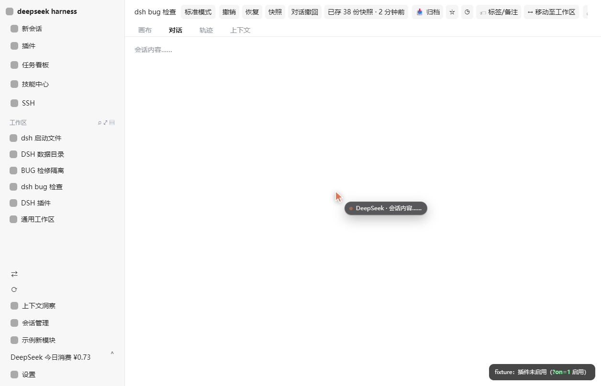
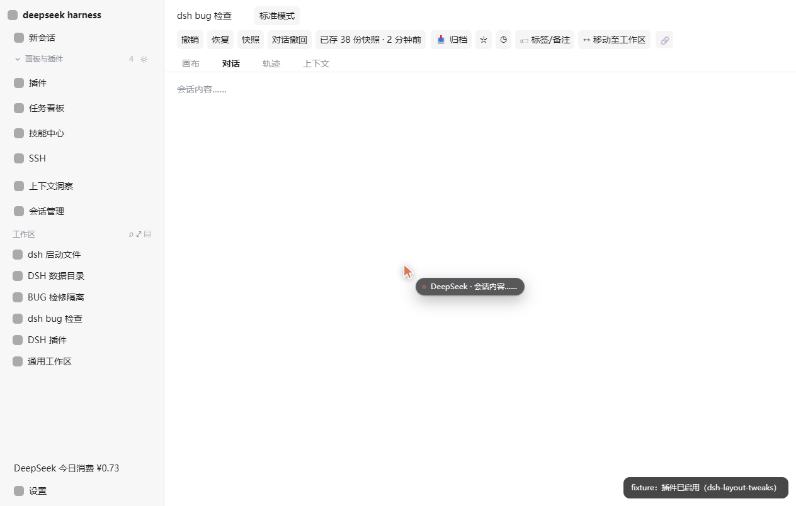
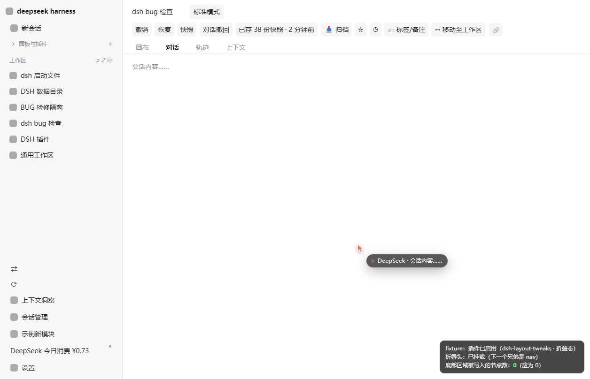
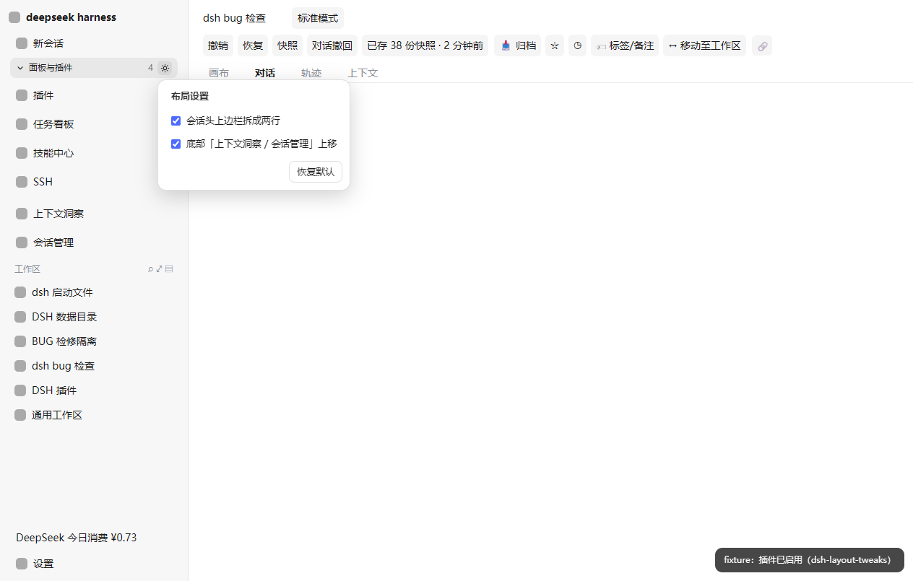

<div align="center">

# dsh-layout-tweaks

**DSH Web GUI 布局微调 —— 会话头上边栏拆成两行、侧栏功能入口并入可折叠块**

纯渲染层实现 · 不修改任何其他插件 · 免构建 · 新插件入口自动归位

[](#)
[](LICENSE)
[](#)
[](#)

[功能](#功能) · [效果](#效果) · [安装](#安装) · [配置](#配置) · [纳入规则](#纳入规则哪些进折叠块哪些留底部) · [工作原理](#工作原理) · [兼容性](#兼容性) · [FAQ](#faq)

[English](README.en.md) | 中文

</div>

---

## 这是什么

DSH Web GUI 里有两处空间浪费：会话头上边栏把所有控件挤在一行；左侧栏顶部的面板模块（插件、任务看板、技能中心、SSH）与底部的功能入口分居两端，把工作区/会话列表挤在中间。

`dsh-layout-tweaks` 用**一个客户端插件**修正这两处，且：

- **不接管任何 slot**、**不修改其他插件的任何代码**；
- 全部通过注入 CSS（外加一个自建的折叠头）完成，React 渲染树零感知；
- **免构建**：`lib/` 直接手写可加载产物，不需要 tsdown / rolldown / tsc；
- 找不到锚点时**静默失效**，绝不会把宿主界面改坏。

## 功能

| # | 功能 | 默认 | 说明 |
|---|------|:----:|------|
| ① | **会话头拆两行** | 开 | 第 1 行 = 会话名 + 工作模式；第 2 行 = 撤销/恢复/快照/归档/标签/移动/删除等其余控件；页签行保持不变 |
| ② | **功能入口并入折叠块** | 开 | 「上下文洞察 / 会话管理」等功能入口从侧栏底部移到面板列表正下方，成为折叠块的一部分 |
| ③ | **折叠块** | 展开 | 侧栏顶部新增折叠头，一键收起「面板列表 + 功能入口」，把空间完整让给工作区/会话列表 |

两个开关（① ②）都可在折叠头的 ⚙ 里即时切换，③ 就是点击折叠头本体。

## 效果

### Before → After

| Before | After |
|:------:|:-----:|
|  |  |

- **头部**：`dsh bug 检查` + `标准模式` 独占第一行，其余控件整体下移一行，不再横向挤压。
- **侧栏**：`▾ 面板与插件 7` → 插件 / 任务看板 / 技能中心 / SSH → **上下文洞察 / 会话管理 / 示例新模块** → 工作区列表 → `⟳ 检查更新` / `⇄ 远程访问` / 今日消费 / 设置。

注意末行：**三个底部常驻控件原地未动**，它们的相对顺序也保持不变。

### ③ 折叠

| 折叠后 | 设置面板 |
|:------:|:--------:|
|  |  |

> 示意图由仓库内的离线夹具 `test/fixture.html` 渲染 —— 它用**实测的 DSH 客户端 DOM**（class 名与层级取自真机核对）复刻了会话头与左侧栏，并内置一个「示例新模块」来演示新插件的默认归属。

## 安装

### 方式一：用 `dsh plugin` 命令（推荐）

```bash
<<<<<<< HEAD
# recommended
=======
>>>>>>> 489626e8dde5b4b12dad769fb75bdb05533fefce
dsh plugin --profile web add "github:TowardsDawn/dsh-layout-tweaks"
```

该命令会把本包写进 profile 的 `dsh.profile.bundles`，并让 bundle 层读取本包的 `cordis.patch.yml`。

### 方式二：手动挂载

1. 把本目录放到任意位置（例如 `<DSH插件目录>/dsh-layout-tweaks`）；
2. 编辑 `<DSH_HOME>/profiles/web/package.json`：

   ```jsonc
   {
     "dependencies": {
       "dsh-layout-tweaks": "file:<本目录绝对路径>"
     },
     "dsh": {
       "profile": {
         "bundles": [
           // …其他插件…
           "dsh-layout-tweaks"
         ]
       }
     }
   }
   ```

3. 重启 `dsh web`。

> 本插件是**纯客户端**插件：host 半（`lib/index.js`）只是装配树里的挂载点，不注册服务、不读取会话。

### 临时停用（不卸载）

编辑本包 `cordis.patch.yml`：

```yaml
- insert:
    - id: dsh-layout-tweaks
      name: 'dsh-layout-tweaks'
      disabled: true
```

### 卸载

删掉 `dsh.profile.bundles` 里的那一行与对应依赖即可。插件在卸载时会自行移除注入样式、自建节点、分类标记与 `<html>` 上的状态属性。

## 配置

所有开关都是**即时生效**的，不需要重启：

- 折叠头上的 **⚙ 布局设置**：勾选/取消 ① 会话头拆两行、② 功能入口并入折叠块；**恢复默认**按钮一键重置。
- 折叠头本体：点击折叠/展开 ③。折叠头上的数字 = 折叠块内的条目总数（面板列表行数 + 功能入口数）。
- 状态持久化在浏览器 `localStorage`，键名 `dsh-layout-tweaks:v1`：

  ```json
  { "headerTwoRows": true, "foldEntries": true, "collapsed": false, "bottomKeep": [] }
  ```

  - `bottomKeep` 是「**额外的保留在底部**」CSS 选择器数组（高级用法），用于把某个未来插件的新控件也钉在底部：

    ```js
    const s = JSON.parse(localStorage.getItem('dsh-layout-tweaks:v1'))
    s.bottomKeep = ['[aria-label*="电量"]', '[class*="my-plugin-footer"]']
    localStorage.setItem('dsh-layout-tweaks:v1', JSON.stringify(s))
    // 然后刷新页面
    ```

  - 清空该键（或点「恢复默认」）即回到出厂设置。

| 状态 | 表现 |
|------|------|
| 首次加载 | ①②③ 全开，折叠头显示为「▾ 面板与插件 N ⚙」 |
| 点击 ⚙ | 弹出设置面板，改动立即写入 `localStorage` 与 `<html>` 属性 |
| 关闭 ② | 功能入口回到宿主原生位置（侧栏底部），分类标记被清除 |
| 侧栏收起为 56px 轨道 | 折叠头自动隐藏（此时面板列表本身也只剩图标列） |

## 纳入规则：哪些进折叠块，哪些留底部

需求的前提是「**新模块要自动进折叠块**」，而「检查更新 / 远程访问 / 今日消费」要原地不动。因此 ② 不是硬编码白名单，而是**运行时分类**：

```
footerActions 的每个直接子元素
        │
        ├─ 含 ≥2 个可点击控件（用量卡这种「主按钮 + 展开箭头」的卡片）─→ 常驻底部
        ├─ 自身或后代命中 BOTTOM_KEEP_SELECTORS ────────────────────→ 常驻底部
        ├─ 命中用户自定义 bottomKeep ──────────────────────────────→ 常驻底部
        └─ 其余（含未来新插件注册的入口）──────────────────────────→ 并入折叠块
```

内置的 `BOTTOM_KEEP_SELECTORS`（用**类名后缀 / 可访问名**匹配，避开会随打包变化的 hash 前缀）：

| 目标 | 匹配方式 |
|------|----------|
| 今日消费卡片 | `[class*="footCard"]` / `footMain` / `footToggle`、`[aria-label*="使用统计"｜"用量"｜"Usage"]`、或「含 ≥2 个按钮」 |
| 检查更新 | `[aria-label*="检查更新"]`、`[title*="检查更新"]`、`[aria-label*="Check for update(s)"]` |
| 远程访问 | `[aria-label*="远程访问"]`、`[title*="远程访问"]`、`[aria-label*="Remote access"]` |
| 注册到 `sidebar.panellist` 的面板 | 天然就在面板列表 `nav` 内，随折叠块一起收起 |

判定会同时检查**条目自身与其后代**：有的插件把按钮包一层容器再注册（如远程访问的 `entryRow > trigger`），可访问名落在内层按钮上。

## 工作原理

### 为什么不走 slot

DSH 的 slot 系统对「重排别人的 UI」有三个硬约束（详见 `@deepseek-ai/dsh-client-ui-slots` 的设计）：

1. **`single` 槽位独占、声明即认领**：`conversation.session.header` 已被 `@deepseek-ai/dsh-client-ui-conversation` 自己注册占据，再注册会抛 `SlotOwnershipError`。
2. **条目的 disposer 会递归移除它声明的子槽**：即使强拆原注册再顶替，`actions` / `utilities` / `corner` 三个子槽连同**其他插件**注册的按钮会一起消失。
3. **`list` 条目的渲染位置由宿主决定**：`sidebar.footer.action` 与 `sidebar.panellist` 是两个不同的槽位与容器，注册对象绑定槽位名，跨容器搬移不可能。

因此本插件只做「渲染层重排」：**不改结构、不搬 React 节点、不抢槽位**。唯一的写入是对底部条目加两个 `data-dsh-lt-*` 分类属性（React 不管理这些属性，重挂载后由 observer 重新打上）。

### ① 会话头拆两行：零 DOM 注入的断行符

真实 DOM（`data-slot` 锚点是 `display:contents` 的透明包装，所以 `titleRow`/`tabs` 直接参与 `<header>` 的 grid）：

```html
<header class="…_header" style="display:grid; grid-template-columns:auto minmax(0,1fr)">
  <div class="…_headerLeading"></div>
  <div data-slot="conversation.session.header" style="display:contents">
    <div class="…_titleRow">
      <div class="…_titleCluster">
        <nav class="…_crumbs">会话名</nav>
        <div class="…_headerActions">
          <div data-slot="conversation.session.header.actions" style="display:contents">
            <span>标准模式</span>  ← agent-preset，order:-10，恒定第一个
            <div>撤销 / 恢复 / 快照 …</div>
            <div>归档 / 标签 / 移动 …</div>
          </div>
        </div>
      </div>
      <div class="…_headerUtilities"></div>
      <div class="…_headerCorner"></div>
    </div>
    <div class="…_tabs" role="tablist"></div>
  </div>
</header>
```

做法：

```css
/* 拆掉 titleCluster / headerActions 两层盒子，让 crumbs 与各控件成为 titleRow 的 flex item */
… > div:first-child{ flex-wrap:wrap }
… > div:first-child > div:has(> nav){ display:contents }
… div:has(> [data-slot="conversation.session.header.actions"]){ display:contents }
/* 零宽断行符：伪元素本身就是 titleRow 的一个 flex item */
… > div:first-child::after{ content:""; order:5; flex-basis:100%; height:0 }
/* 排序 */
… nav{ order:0 }
[data-slot="conversation.session.header.actions"] > *:nth-child(1){ order:1 }   /* 工作模式 */
[data-slot="conversation.session.header.actions"] > *:nth-child(n+2){ order:10 }
… headerUtilities{ order:11 }  … headerCorner{ order:12 }
```

`::after` 伪元素的妙处：它天然是宿主元素内部的 flex item，因此**不需要往 DOM 里插任何节点**就能造出断行点，React reconciliation 完全无感。

### ② 折叠块：`order` 排序 + 运行时分类

侧栏根（ui-sidebar 的 SidebarRoot 根节点）是 `display:flex; flex-direction:column`，其直接子元素依次是 品牌行 / 新会话 / 面板列表(`nav`) / 工作区区 / 底部区。

把底部区与它的第一个子元素（`footerActions`）逐层 `display:contents` 打开后，底部条目在**布局上**变成侧栏根的 flex item，于是 `order` 可以精确排序：

```css
… > div > *:last-child{ display:contents }                       /* footArea */
… > div > *:last-child > *:first-child{ display:contents }       /* footerActions */
… > div > *{ order:40 }                                          /* 基线：留底 */
… > div > *:last-child > *:first-child
        > *:not([data-dsh-lt-fold]):not([data-dsh-lt-keep]){ order:40 }   /* 未分类者留底 */
… > div > *:nth-child(-n+2){ order:0 }                           /* 品牌行 + 新会话 */
… > div > .dsh-lt-head{ order:9 }                                /* 折叠头 */
… > div > nav{ order:10 }                                        /* 面板列表 */
[data-dsh-lt-fold]{ order:15; margin:0 2px 4px }                 /* 功能入口 → 折叠块 */
[data-dsh-lt-keep]{ order:40 }                                   /* 底部常驻控件 */
… > div > div:has(> [data-slot="sidebar.workspaces"]){ order:30 } /* 工作区列表 */
… > div > *:last-child > *:last-child{ order:50 }                /* 设置 */
```

分类属性由 JS 在每次 DOM 变更后（`MutationObserver` + `rAF` 节流）维护，规则见[纳入规则](#纳入规则哪些进折叠块哪些留底部)。

> **实现笔记（两个真踩过的坑）**
>
> 1. **`order` 作用于「布局」上的 flex item，而选择器必须按「DOM 层级」书写。** `display:contents` 只让 `footerActions` 在布局上透明，它在 DOM 里仍是那些条目的父元素 —— 最初写成 `… > div > [class*="lc-ov-entry"]`（直接子级）匹配不到任何东西，条目保持默认 `order:0` 全部堆到侧栏顶上。正确写法要经过 `*:last-child > *:first-child` 这一层。
> 2. **基线规则的特异性会反噬分类规则。** `… > *:last-child > *:first-child > *{ order:40 }` 比 `[data-dsh-lt-fold]{ order:15 }` 更长、特异性更高，会把分类结果全部盖掉（现象：所有条目都停在 `order:40`）。所以基线要加 `:not([data-dsh-lt-fold]):not([data-dsh-lt-keep])`，只管未分类的条目。

### ③ 折叠头

唯一注入的 DOM 节点（`.dsh-lt-head`），由插件自己创建、自己插入、自己清理：

- 定位锚点：侧栏根的直接子元素 `nav`（面板列表），退化为工作区区容器；用 `insertBefore` 放在它前面，**不移动任何 React 管理的节点**；
- 维护方式：`MutationObserver`（`documentElement` + `subtree`）＋ `requestAnimationFrame` 节流，确保 SPA 重挂载后回到位；
- 自激防护：文本只在真的变化时写入（否则 `textContent` 赋值会再次触发 observer）；
- 侧栏收起为 56px 轨道时由 CSS 隐藏（`[class*="collapsed"]`）。

### 使用的 DOM 锚点

| 用途 | 锚点 |
|------|------|
| 会话头槽位 | `[data-slot="conversation.session.header"]` |
| 头部控件槽位 | `[data-slot="conversation.session.header.actions" / `.utilities` / `.corner`]` |
| 侧栏宿主 / 根 | `[data-slot="sidebar"]` → 其第一个子元素 |
| 面板列表 | 侧栏根的直接子元素 `nav` |
| 工作区区 | 侧栏根的子元素 `div:has(> [data-slot="sidebar.workspaces"])` |
| 底部条目容器 | 侧栏根的最后一个子元素（底部区）→ 它的第一个子元素（`footerActions`） |

全部为 **`data-slot` 属性、结构关系与条目的可访问名/类名后缀**，**不使用会随版本变化的 CSS Module hash 前缀**（如 `wSkVaW_` / `hHd-Xa_`）。

## 兼容性

| 项目 | 要求 |
|------|------|
| 宿主 | DSH Web 客户端（DOM 形态基于 0.2.0-rc 系列实测） |
| 浏览器 | 支持 `:has()` 的现代浏览器（Chrome / Edge 105+、Firefox 121+、Safari 15.4+） |
| 降级 | 不支持 `:has()` 时重排规则被 `@supports` 挡下，插件静默不生效；折叠功能仍可用 |
| Node（仅安装时） | ≥ 22.19 |

## 已知限制

- **依赖宿主 DOM 形态**：DSH 大版本若重构会话头或侧栏结构，规则会失配。此时表现是「插件不生效」而不是报错；更新选择器即可。
- **折叠头假设侧栏根前两个子元素是品牌行与新会话**（用于把它们固定在顶部）。若上游调整顺序，需同步改 `:nth-child(-n+2)`。
- **`display:contents` 会撤销 `footerActions` 自身的 flex 排布**：目前底部条目都是整行块级控件或独立卡片，拆开后观感一致；若未来某个条目依赖父级横向排列，需要单独补样式。
- **分类依赖「可访问名 / 类名后缀」**：若某个插件把 `aria-label` 换语言、把类名换成无语义 hash，需要往 `BOTTOM_KEEP_SELECTORS` 补一条，或写进 `bottomKeep`。
- **折叠头是自建节点**：面板列表为空的极端情况下，它会退化为插在工作区区之上（仍可点击，只是没有面板可折叠）。
- **`order` 无法把条目插进另一个容器的「内部」**：② 只让底部条目在布局顺序上紧跟面板列表，它们在 DOM 上仍属于底部区。

## FAQ

<details>
<summary><b>新装的插件会自动进折叠块吗？</b></summary>

会。注册到 `sidebar.panellist` 的面板天然在面板列表内；注册到 `sidebar.footer.action` 的入口**默认即视为折叠块成员**，不需要改本插件。只有被识别为「底部常驻控件」的才会留在最下方 —— 想改写判定，用 `bottomKeep` 或直接改 `BOTTOM_KEEP_SELECTORS`。
</details>

<details>
<summary><b>为什么不做成标准的 slot 插件？</b></summary>

见[工作原理](#工作原理) —— `single` 槽位独占、子槽级联销毁、list 条目位置由宿主决定，这三条让「重排别人的 UI」在 slot 层无法实现。渲染层重排是唯一不牵连其他插件的做法。
</details>

<details>
<summary><b>会影响其他插件吗？</b></summary>

不会。插件不调用任何其他插件的接口、不改它们的注册、不移动它们渲染的节点。它对 DOM 的写入只有两类：一个属于自己的折叠头节点，以及底部条目上的两个 `data-dsh-lt-*` 分类属性。卸载时两者都被清理。
</details>

<details>
<summary><b>改完要重启 DSH 吗？</b></summary>

安装/卸载需要重启 `dsh web`；日常开关（勾选项、折叠）**不需要**，即时生效并自动记忆。
</details>

<details>
<summary><b>怎么完全恢复原样？</b></summary>

在折叠头的 ⚙ 里点「恢复默认」，或清掉 `localStorage` 的 `dsh-layout-tweaks:v1`。要在装配层面彻底移除，见[安装](#安装)里的「卸载」。
</details>

<details>
<summary><b>为什么第二行的控件换行了 / 位置和我预期不同？</b></summary>

第二行是一个普通 flex 行（`flex-wrap`），窗口很窄或注册了很多头部按钮时会自然溢出到更多行 —— 这是刻意行为，保证控件不被裁切。
</details>

## 开发

本插件**免构建**，`lib/` 即产物：

```bash
# 语法与模块注册自检
node --check lib/client.js
node --check lib/index.js

# 离线夹具：用实测 DOM 复刻件验证布局（无需登录 GUI）
#   test/fixture.html                  → 关闭插件（before）
#   test/fixture.html?on=1             → 启用插件（after）
#   test/fixture.html?on=1&collapsed=1 → 启用并处于折叠态
```

夹具里内置了三类底部条目（图标按钮 / 功能入口 / 多控件卡片）外加一个「示例新模块」，用来回归验证分类规则。修改 `lib/client.js` 里的 `CSS` 常量或 `BOTTOM_KEEP_SELECTORS` 后，刷新浏览器即可看到结果；若在真实 DSH 里验证，注意先展开侧栏（收起为 56px 轨道时插件不显示折叠头）。

## 目录结构

```
dsh-layout-tweaks/
├─ lib/
│  ├─ index.js          # host 半：空挂载点
│  └─ client.js         # 浏览器半：样式 + 分类 + 折叠头 + 状态（免构建）
├─ test/
│  └─ fixture.html      # 离线夹具（实测 DOM 复刻）
├─ assets/              # README 截图
├─ cordis.patch.yml     # bundle patch：把插件挂进装配树
├─ package.json
├─ CHANGELOG.md
└─ LICENSE
```

## License

[MIT](LICENSE)
